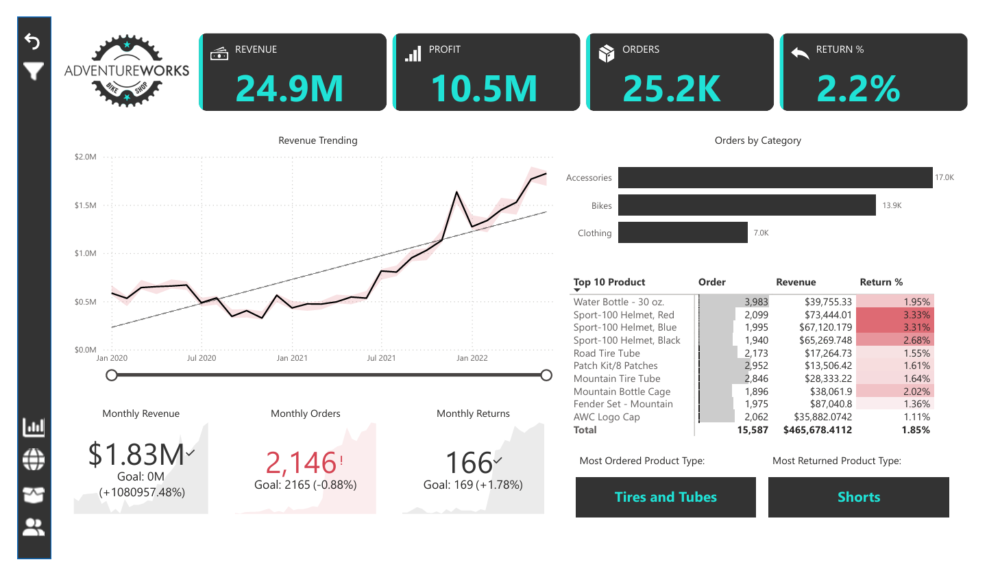

# AdventureWorks Sales Dashboard – Power BI Project

This project is a professional-quality Power BI report developed as part of a hands-on business intelligence course. It analyzes key sales metrics for AdventureWorks Cycles, a fictional manufacturing company.

## 🧰 Tools Used
- Microsoft Power BI Desktop
- Power Query
- DAX
- Data Visualization & Dashboard Design

## 📊 Report Highlights
- Sales KPIs by Region, Product, and Channel
- Customer Segmentation & High-Value Targeting
- Forecasting & Trend Lines
- Interactive Slicer Panels, Drillthroughs, and Custom Tooltips

## 📁 Files Included
- `AdventureWorksDashboard.pbix` – Main Power BI report
- `/assets/` – Screenshots of report pages
- `dashboard_export.pdf` – Printable static version of the dashboard

## 💡 Key Learnings
- Built a relational star schema model from raw data
- Used advanced DAX for custom measures
- Designed mobile-friendly, interactive dashboards
- Explored AI visuals like Key Influencers & Smart Narratives

## 🖼️ Preview

